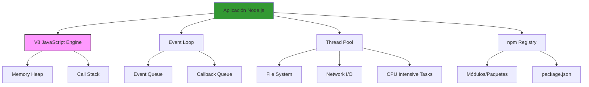
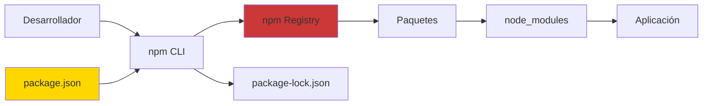
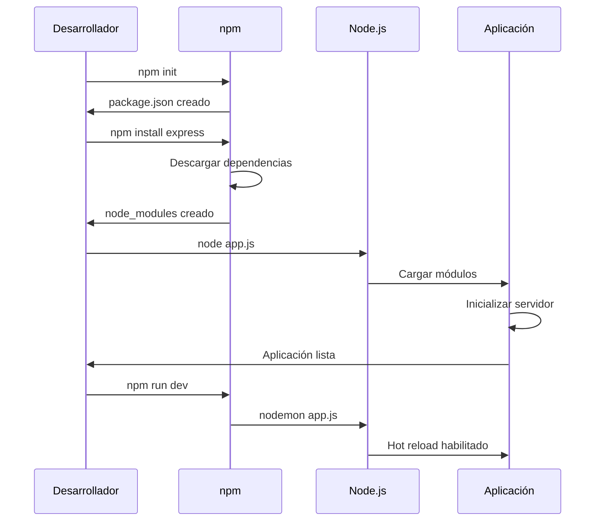

# 📚 Introducción a Node.js y npm/nvm

## 🚀 ¿Qué es Node.js?

Node.js es un entorno de ejecución de JavaScript construido sobre el motor V8 de Chrome que permite ejecutar JavaScript del lado del servidor. Convierte JavaScript de un lenguaje exclusivo del navegador a una plataforma completa de desarrollo backend.

## 🏗️ Historia y Origen

### ¿De dónde nace Node.js?

- **Año de creación**: 2009
- **Creador**: Ryan Dahl
- **Empresa inicial**: Joyent (ahora mantenido por OpenJS Foundation)
- **Motivación**: Crear aplicaciones de red escalables y eficientes
- **Primera versión**: 0.1.0 en mayo de 2009

### ¿Por qué surgió?

Los problemas que resolvía Node.js:

- **Bloqueo de I/O**: Los servidores tradicionales bloqueaban hilos esperando operaciones de entrada/salida
- **Escalabilidad**: Dificultad para manejar miles de conexiones concurrentes
- **Unificación de lenguaje**: Usar JavaScript tanto en frontend como backend
- **Desarrollo web lento**: Necesidad de herramientas más rápidas para desarrollo

### Hito importante: El fork io.js (2014-2015)

- Divergencia por diferencias en la dirección del proyecto
- Reunificación en 2015 bajo Node.js Foundation
- Resultado: Desarrollo más rápido y gobernanza mejorada

## 🎯 ¿Por qué es importante Node.js?

### Ventajas principales:

1. **Event-Driven y Non-Blocking I/O**

   - Maneja miles de conexiones concurrentes eficientemente
   - Ideal para aplicaciones en tiempo real

2. **JavaScript en el servidor**

   - Un solo lenguaje para frontend y backend
   - Reutilización de código y conocimientos

3. **Ecosistema npm gigantesco**

   - Más de 1.3 millones de paquetes disponibles
   - Soluciones para casi cualquier problema

4. **Rapidez de desarrollo**

   - Prototipado rápido
   - Sintaxis familiar para desarrolladores web

5. **Gran comunidad**
   - Soporte activo y abundante documentación
   - Empresas como Netflix, Uber, PayPal lo utilizan

### Desventajas:

1. **Single-threaded para CPU-intensive**

   - No es ideal para operaciones que requieren mucho procesamiento

2. **Callback Hell**

   - Código anidado complejo (mitigado con Promises/async-await)

3. **Cambios frecuentes**

   - Ecosistema en constante evolución
   - Dependencias pueden volverse obsoletas rápidamente

4. **Debugging complejo**
   - Errores asincrónicos pueden ser difíciles de rastrear

## 🛠️ Instalación y Configuración

### Prerrequisitos

- **Sistema Operativo**: Windows, macOS, o Linux
- **Privilegios**: Permisos de administrador para instalación global

### Métodos de instalación

#### 1. Instalación directa (No recomendado para desarrollo)

```bash
# Descargar desde https://nodejs.org/
# Instalar la versión LTS (Long Term Support)
```

#### 2. Usando NVM (Node Version Manager) - ⭐ RECOMENDADO

**Para Linux/macOS:**

```bash
# Instalar NVM
curl -o- https://raw.githubusercontent.com/nvm-sh/nvm/v0.39.0/install.sh | bash

# Recargar terminal
source ~/.bashrc

# Verificar instalación
nvm --version

# Instalar Node.js LTS
nvm install --lts
nvm use --lts

# Listar versiones instaladas
nvm list

# Instalar versión específica
nvm install 18.17.0
nvm use 18.17.0
```

**Para Windows:**

```bash
# Instalar nvm-windows desde GitHub
# https://github.com/coreybutler/nvm-windows

# En PowerShell como administrador
nvm install lts
nvm use lts
```

#### 3. Usando gestores de paquetes del sistema

**Ubuntu/Debian:**

```bash
# Actualizar repositorios
sudo apt update

# Instalar Node.js y npm
sudo apt install nodejs npm

# Verificar versiones
node --version
npm --version
```

**macOS (con Homebrew):**

```bash
# Instalar Homebrew si no lo tienes
/bin/bash -c "$(curl -fsSL https://raw.githubusercontent.com/Homebrew/install/HEAD/install.sh)"

# Instalar Node.js
brew install node

# Verificar instalación
node --version
npm --version
```

### Verificación de instalación

```bash
# Verificar Node.js
node --version
# Salida esperada: v18.17.0 (o similar)

# Verificar npm
npm --version
# Salida esperada: 9.6.7 (o similar)

# Ejecutar REPL de Node.js
node
> console.log("¡Hola Node.js!")
> .exit
```

## 🏗️ Arquitectura de Node.js



## 📦 Ecosistema npm

### ¿Qué es npm?

**npm** (Node Package Manager) es el gestor de paquetes de Node.js y el registro de software más grande del mundo.



### Comandos esenciales de npm

```bash
# Inicializar proyecto
npm init
npm init -y  # Usar valores por defecto

# Instalar dependencias
npm install express          # Dependencia de producción
npm install --save express   # Explícitamente en dependencies
npm install --save-dev jest  # Dependencia de desarrollo
npm install -g nodemon       # Instalación global

# Gestión de paquetes
npm list                     # Listar paquetes instalados
npm list -g                  # Paquetes globales
npm outdated                 # Paquetes desactualizados
npm update                   # Actualizar paquetes
npm uninstall express        # Desinstalar paquete

# Scripts personalizados
npm run start               # Ejecutar script "start"
npm run dev                 # Ejecutar script "dev"
npm test                    # Ejecutar pruebas

# Información y búsqueda
npm info express            # Información del paquete
npm search express          # Buscar paquetes
```

### Estructura del package.json

```json
{
  "name": "mi-proyecto-node",
  "version": "1.0.0",
  "description": "Mi primera aplicación Node.js",
  "main": "index.js",
  "scripts": {
    "start": "node index.js",
    "dev": "nodemon index.js",
    "test": "jest"
  },
  "keywords": ["node", "javascript", "api"],
  "author": "Tu Nombre",
  "license": "MIT",
  "dependencies": {
    "express": "^4.18.2"
  },
  "devDependencies": {
    "nodemon": "^2.0.22",
    "jest": "^29.5.0"
  }
}
```

## 🚀 Conceptos Esenciales

### 1. Módulos en Node.js

**CommonJS (tradicional):**

```javascript
// math.js
function suma(a, b) {
  return a + b;
}

function resta(a, b) {
  return a - b;
}

module.exports = { suma, resta };

// app.js
const { suma, resta } = require("./math");
console.log(suma(5, 3)); // 8
```

**ES Modules (moderno):**

```javascript
// math.mjs
export function suma(a, b) {
  return a + b;
}

export function resta(a, b) {
  return a - b;
}

// app.mjs
import { suma, resta } from "./math.mjs";
console.log(suma(5, 3)); // 8
```

### 2. Event Loop y Asincronía

```javascript
// Ejemplo de Event Loop
console.log("1. Inicio");

setTimeout(() => {
  console.log("3. Timeout");
}, 0);

Promise.resolve().then(() => {
  console.log("2. Promise");
});

console.log("4. Fin");

// Salida:
// 1. Inicio
// 4. Fin
// 2. Promise
// 3. Timeout
```

### 3. Servidor HTTP básico

```javascript
// servidor.js
const http = require("http");

const servidor = http.createServer((req, res) => {
  res.writeHead(200, { "Content-Type": "text/html; charset=utf-8" });
  res.end("¡Hola mundo desde Node.js!");
});

const PUERTO = 3000;
servidor.listen(PUERTO, () => {
  console.log(`Servidor ejecutándose en http://localhost:${PUERTO}`);
});
```

### 4. Trabajando con archivos

```javascript
// archivo.js
const fs = require("fs").promises;

async function leerArchivo() {
  try {
    const contenido = await fs.readFile("datos.txt", "utf8");
    console.log(contenido);
  } catch (error) {
    console.error("Error al leer archivo:", error);
  }
}

async function escribirArchivo() {
  try {
    await fs.writeFile("salida.txt", "Contenido del archivo");
    console.log("Archivo creado exitosamente");
  } catch (error) {
    console.error("Error al escribir archivo:", error);
  }
}
```

## 🌐 Desarrollo Web con Express.js

### Instalación de Express

```bash
npm install express
```

### Servidor básico con Express

```javascript
// app.js
const express = require("express");
const app = express();
const puerto = 3000;

// Middleware
app.use(express.json());

// Rutas
app.get("/", (req, res) => {
  res.send("¡Hola desde Express!");
});

app.get("/api/usuarios", (req, res) => {
  res.json([
    { id: 1, nombre: "Juan" },
    { id: 2, nombre: "María" },
  ]);
});

app.post("/api/usuarios", (req, res) => {
  const nuevoUsuario = req.body;
  res.status(201).json(nuevoUsuario);
});

app.listen(puerto, () => {
  console.log(`Servidor corriendo en http://localhost:${puerto}`);
});
```

## 📊 Ciclo de Desarrollo con Node.js



## 🛡️ Mejores Prácticas

### 1. Estructura de proyecto

```
mi-proyecto/
├── src/
│   ├── controllers/     # Controladores
│   ├── models/         # Modelos de datos
│   ├── routes/         # Rutas de la API
│   ├── middleware/     # Middleware personalizado
│   ├── config/         # Configuraciones
│   └── utils/          # Utilidades
├── tests/              # Pruebas
├── public/             # Archivos estáticos
├── package.json
├── .gitignore
├── .env               # Variables de entorno
└── README.md
```

### 2. Variables de entorno

```bash
# .env
PORT=3000
DB_HOST=localhost
DB_USER=usuario
DB_PASSWORD=contraseña
JWT_SECRET=mi_secreto_super_seguro
```

```javascript
// config/config.js
require("dotenv").config();

module.exports = {
  port: process.env.PORT || 3000,
  dbHost: process.env.DB_HOST,
  dbUser: process.env.DB_USER,
  dbPassword: process.env.DB_PASSWORD,
  jwtSecret: process.env.JWT_SECRET,
};
```

### 3. Manejo de errores

```javascript
// middleware/errorHandler.js
const errorHandler = (err, req, res, next) => {
  console.error(err.stack);

  res.status(err.status || 500).json({
    mensaje: err.message || "Error interno del servidor",
    ...(process.env.NODE_ENV === "development" && { stack: err.stack }),
  });
};

module.exports = errorHandler;
```

### 4. Scripts útiles en package.json

```json
{
  "scripts": {
    "start": "node src/app.js",
    "dev": "nodemon src/app.js",
    "test": "jest",
    "test:watch": "jest --watch",
    "lint": "eslint src/",
    "lint:fix": "eslint src/ --fix"
  }
}
```

## 🔧 Herramientas de Desarrollo

### Herramientas esenciales

```bash
# Nodemon - Reinicio automático
npm install -g nodemon

# ESLint - Linting de código
npm install --save-dev eslint

# Prettier - Formateo de código
npm install --save-dev prettier

# Jest - Testing
npm install --save-dev jest

# dotenv - Variables de entorno
npm install dotenv
```

### Configuración de desarrollo

**.eslintrc.js:**

```javascript
module.exports = {
  env: {
    node: true,
    es2021: true,
  },
  extends: ["eslint:recommended"],
  parserOptions: {
    ecmaVersion: 12,
    sourceType: "module",
  },
  rules: {
    "no-console": "warn",
    "no-unused-vars": "error",
  },
};
```

**.gitignore:**

```
node_modules/
*.log
.env
.DS_Store
coverage/
dist/
```

## 📚 Paquetes npm Populares

### Desarrollo web

- **express**: Framework web minimalista
- **koa**: Framework web más moderno
- **fastify**: Framework web de alto rendimiento

### Base de datos

- **mongoose**: ODM para MongoDB
- **sequelize**: ORM para SQL
- **prisma**: ORM moderno y type-safe

### Utilidades

- **lodash**: Librería de utilidades
- **moment/dayjs**: Manipulación de fechas
- **axios**: Cliente HTTP
- **joi**: Validación de esquemas

### Testing

- **jest**: Framework de testing
- **mocha**: Framework de testing
- **supertest**: Testing de APIs HTTP

## 🎯 Primer Proyecto: API REST Simple

### 1. Inicializar proyecto

```bash
mkdir mi-api-rest
cd mi-api-rest
npm init -y
```

### 2. Instalar dependencias

```bash
npm install express
npm install --save-dev nodemon
```

### 3. Crear la aplicación

```javascript
// app.js
const express = require("express");
const app = express();
const puerto = process.env.PORT || 3000;

app.use(express.json());

// Datos de ejemplo
let usuarios = [
  { id: 1, nombre: "Ana", email: "ana@email.com" },
  { id: 2, nombre: "Carlos", email: "carlos@email.com" },
];

// Rutas
app.get("/api/usuarios", (req, res) => {
  res.json(usuarios);
});

app.get("/api/usuarios/:id", (req, res) => {
  const usuario = usuarios.find((u) => u.id === parseInt(req.params.id));
  if (!usuario) {
    return res.status(404).json({ mensaje: "Usuario no encontrado" });
  }
  res.json(usuario);
});

app.post("/api/usuarios", (req, res) => {
  const nuevoUsuario = {
    id: usuarios.length + 1,
    nombre: req.body.nombre,
    email: req.body.email,
  };
  usuarios.push(nuevoUsuario);
  res.status(201).json(nuevoUsuario);
});

app.listen(puerto, () => {
  console.log(`🚀 Servidor corriendo en http://localhost:${puerto}`);
});
```

### 4. Configurar scripts

```json
{
  "scripts": {
    "start": "node app.js",
    "dev": "nodemon app.js"
  }
}
```

### 5. Ejecutar proyecto

```bash
npm run dev
```

### 6. Probar la API

```bash
# Obtener todos los usuarios
curl http://localhost:3000/api/usuarios

# Crear nuevo usuario
curl -X POST http://localhost:3000/api/usuarios \
  -H "Content-Type: application/json" \
  -d '{"nombre":"Pedro","email":"pedro@email.com"}'
```

## 🚀 Próximos Pasos

1. **Profundizar en Express.js** - Middleware, routing avanzado, templates
2. **Bases de datos** - Conectar con MongoDB, PostgreSQL, MySQL
3. **Autenticación** - JWT, OAuth, sesiones
4. **Testing** - Pruebas unitarias e integración con Jest
5. **Deployment** - Heroku, Vercel, AWS, Docker
6. **Microservicios** - Arquitectura distribuida con Node.js
7. **WebSockets** - Aplicaciones en tiempo real
8. **GraphQL** - APIs más flexibles

## 💡 Consejos de Aprendizaje

### Para gestión de versiones con NVM:

```bash
# Archivo .nvmrc en la raíz del proyecto
echo "18.17.0" > .nvmrc

# Los colaboradores pueden usar:
nvm use  # Usa la versión especificada en .nvmrc
```

### Debugging en Node.js:

```bash
# Usar el debugger incorporado
node --inspect app.js

# O con nodemon
nodemon --inspect app.js
```

### Performance:

```javascript
// Usar async/await para operaciones asíncronas
async function procesarDatos() {
  try {
    const datos = await obtenerDatos();
    const resultado = await procesarDatos(datos);
    return resultado;
  } catch (error) {
    console.error("Error:", error);
  }
}
```

---

**💡 Consejo clave**: Node.js brilla en aplicaciones I/O intensivas. Aprovecha su naturaleza asíncrona para crear aplicaciones escalables y eficientes.

**🎯 Objetivo de aprendizaje**: Al dominar Node.js y npm, podrás crear aplicaciones web completas, APIs REST, herramientas de línea de comandos y microservicios usando JavaScript como lenguaje único de desarrollo.
