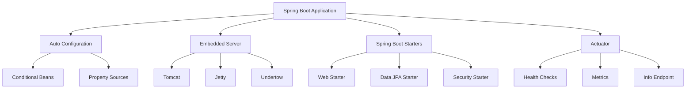
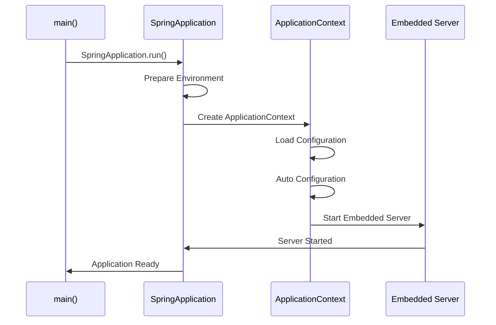

# 📚 Introducción a Spring Boot

## 🌱 ¿Qué es Spring Boot?

Spring Boot es un framework de Java que simplifica el desarrollo de aplicaciones empresariales basadas en Spring. Fue creado para eliminar la complejidad de configuración que tradicionalmente requería el framework Spring.

## 🏗️ Historia y Origen

### ¿De dónde nace Spring Boot?

- **Año de creación**: 2012-2014 por Pivotal Team (ahora VMware)
- **Creador principal**: Phil Webb y Dave Syer
- **Motivación**: Resolver el "problema de configuración" de Spring Framework
- **Primera versión estable**: 1.0.0 en abril de 2014

### ¿Por qué surgió?

Spring Framework, aunque poderoso, requería:

- Configuración XML extensa
- Múltiples archivos de configuración
- Configuración manual de servidores
- Gestión compleja de dependencias

## 🎯 ¿Por qué es importante Spring Boot?

### Ventajas principales:

1. **Configuración automática (Auto-configuration)**
   - Configura automáticamente tu aplicación basándose en las dependencias presentes
2. **Servidores embebidos**

   - Incluye Tomcat, Jetty o Undertow por defecto
   - No necesitas desplegar en servidores externos

3. **Gestión de dependencias simplificada**

   - Spring Boot Starters: paquetes preconfigurados de dependencias

4. **Monitoreo y métricas**

   - Spring Boot Actuator para monitoreo en producción

5. **Convención sobre configuración**
   - Menos código, más productividad

### Desventajas:

1. **Tamaño de la aplicación**

   - Las aplicaciones pueden ser más pesadas debido a dependencias incluidas

2. **Curva de aprendizaje**

   - Aunque simplifica Spring, aún requiere conocimiento del ecosistema

3. **Menos control granular**

   - La auto-configuración puede ocultar detalles importantes

4. **Dependencia del ecosistema Spring**
   - Fuerte acoplamiento con las herramientas de Spring

## 🛠️ Instalación y Configuración

### Prerrequisitos

- **Java**: JDK 8 o superior (recomendado JDK 11+)
- **Maven** o **Gradle** como herramienta de construcción
- **IDE**: IntelliJ IDEA, Eclipse, o VS Code

### Métodos de instalación

#### 1. Spring Initializr (Recomendado)

```bash
# Visita: https://start.spring.io/
# Selecciona:
# - Project: Maven/Gradle
# - Language: Java
# - Spring Boot: 3.x.x (última versión)
# - Dependencies: Spring Web, Spring Data JPA, etc.
```

#### 2. Usando Spring Boot CLI

```bash
# Instalar SDKMAN
curl -s "https://get.sdkman.io" | bash

# Instalar Spring Boot CLI
sdk install springboot

# Crear proyecto
spring init --dependencies=web,data-jpa mi-proyecto
```

#### 3. Maven Archetype

```bash
mvn archetype:generate \
  -DgroupId=com.ejemplo \
  -DartifactId=mi-app-springboot \
  -DarchetypeArtifactId=maven-archetype-quickstart \
  -DinteractiveMode=false
```

### Estructura básica del proyecto

```
mi-proyecto/
├── src/
│   ├── main/
│   │   ├── java/
│   │   │   └── com/ejemplo/
│   │   │       └── MiAplicacion.java
│   │   └── resources/
│   │       ├── application.properties
│   │       └── static/
│   └── test/
├── target/
└── pom.xml (o build.gradle)
```

## 🏗️ Arquitectura de Spring Boot



## 🚀 Conceptos Esenciales

### 1. Aplicación Principal

```java
@SpringBootApplication
public class MiAplicacion {
    public static void main(String[] args) {
        SpringApplication.run(MiAplicacion.class, args);
    }
}
```

**@SpringBootApplication** combina:

- `@Configuration`: Clase de configuración
- `@EnableAutoConfiguration`: Habilita auto-configuración
- `@ComponentScan`: Escanea componentes en el paquete

### 2. Spring Boot Starters

Los starters son dependencias preconfiguradas:

```xml
<dependency>
    <groupId>org.springframework.boot</groupId>
    <artifactId>spring-boot-starter-web</artifactId>
</dependency>
```

**Starters principales:**

- `spring-boot-starter-web`: Para aplicaciones web
- `spring-boot-starter-data-jpa`: Para acceso a datos con JPA
- `spring-boot-starter-security`: Para seguridad
- `spring-boot-starter-test`: Para pruebas

### 3. Configuración con Properties

```properties
# application.properties
server.port=8080
spring.datasource.url=jdbc:mysql://localhost:3306/midb
spring.datasource.username=usuario
spring.datasource.password=contraseña
```

### 4. Controladores REST

```java
@RestController
@RequestMapping("/api")
public class MiControlador {

    @GetMapping("/saludo")
    public String saludo() {
        return "¡Hola desde Spring Boot!";
    }
}
```

## 📊 Ciclo de Vida de una Aplicación Spring Boot



## 🛡️ Mejores Prácticas

### 1. Estructura de Paquetes

```
com.empresa.proyecto/
├── controller/     # Controladores REST
├── service/       # Lógica de negocio
├── repository/    # Acceso a datos
├── model/         # Entidades/DTOs
├── config/        # Configuraciones
└── Application.java
```

### 2. Configuración por Perfiles

```properties
# application-dev.properties
spring.datasource.url=jdbc:h2:mem:testdb

# application-prod.properties
spring.datasource.url=jdbc:mysql://prod-server:3306/db
```

### 3. Manejo de Excepciones

```java
@ControllerAdvice
public class GlobalExceptionHandler {

    @ExceptionHandler(Exception.class)
    public ResponseEntity<String> handleException(Exception e) {
        return ResponseEntity.status(500).body("Error: " + e.getMessage());
    }
}
```

## 🔧 Herramientas de Desarrollo

### Spring Boot DevTools

```xml
<dependency>
    <groupId>org.springframework.boot</groupId>
    <artifactId>spring-boot-devtools</artifactId>
    <scope>runtime</scope>
</dependency>
```

**Beneficios:**

- Reinicio automático de la aplicación
- Recarga automática de plantillas
- Configuraciones adicionales para desarrollo

### Spring Boot Actuator

```xml
<dependency>
    <groupId>org.springframework.boot</groupId>
    <artifactId>spring-boot-starter-actuator</artifactId>
</dependency>
```

**Endpoints útiles:**

- `/actuator/health`: Estado de la aplicación
- `/actuator/info`: Información de la aplicación
- `/actuator/metrics`: Métricas de rendimiento

## 📚 Recursos de Aprendizaje

### Documentación Oficial

- [Spring Boot Reference Guide](https://docs.spring.io/spring-boot/docs/current/reference/htmlsingle/)
- [Spring Boot Guides](https://spring.io/guides)

### Herramientas Recomendadas

- **IDE**: IntelliJ IDEA (plugin Spring Boot)
- **Cliente REST**: Postman o Insomnia
- **Base de datos**: H2 (desarrollo), MySQL/PostgreSQL (producción)

## 🎯 Primer Proyecto: "Hola Mundo"

### 1. Crear proyecto con Spring Initializr

- Dependencies: Spring Web
- Java Version: 11+

### 2. Crear controlador

```java
@RestController
public class HolaMundoController {

    @GetMapping("/")
    public String holaMundo() {
        return "¡Hola Mundo con Spring Boot!";
    }
}
```

### 3. Ejecutar aplicación

```bash
mvn spring-boot:run
# o
./mvnw spring-boot:run
```

### 4. Probar en navegador

```
http://localhost:8080/
```

---

**💡 Consejo**: Spring Boot sigue el principio "Convention over Configuration". Aprovecha las configuraciones por defecto y personaliza solo lo necesario.

**🎯 Objetivo de aprendizaje**: Al dominar Spring Boot, podrás desarrollar aplicaciones empresariales robustas y escalables con Java de manera eficiente.
