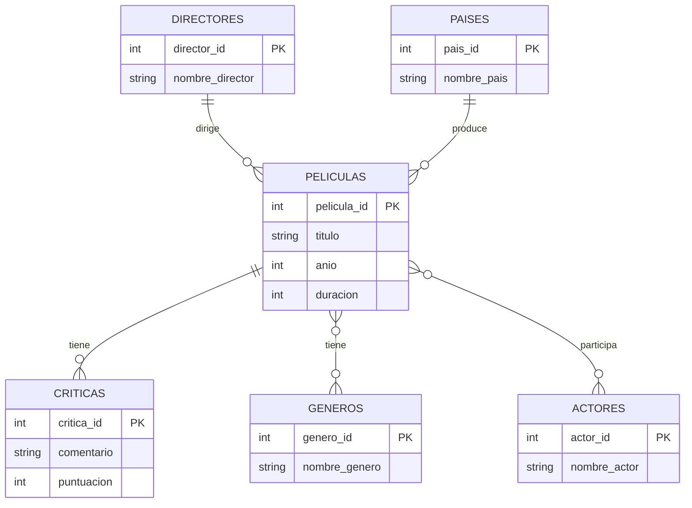

# 🤔 ¿Qué es una base de datos?

Una base de datos (BDD) es un **sistema organizado** de almacenamiento que estructura información para permitir acceso, gestión y actualización eficientes. Los datos se almacenan de forma **interconectada** y **optimizada**, facilitando consultas rápidas y análisis complejos mediante relaciones lógicas entre elementos.


## Analogía: **Chef Michelin**

Piensen en un restaurante con estrella Michelin. El chef no solo tiene ingredientes; tiene un **sistema perfecto** donde:

- Cada ingrediente está **catalogado** (nombre, fecha de vencimiento, proveedor)
- Está **organizado** por tipo, frecuencia de uso, temperatura requerida
- Se puede **acceder rápidamente** cuando se necesita
- Se **actualiza automáticamente** el inventario
- Se **relaciona** con recetas, menús y pedidos

Así funciona una base de datos: no solo almacena datos, los **organiza inteligentemente** para que cuando los necesites, estén listos para servir.

> Una base de datos no es solo un "archivo grande". Es un **ecosistema inteligente** donde la > información vive, respira y se conecta. Es como tener un asistente personal que nunca duerme, > nunca olvida y puede encontrar cualquier dato entre millones en fracciones de segundo.

---

# 🔧 ¿Qué son los sistemas de gestión de BDD?

Los sistemas de gestión de bases de datos (DBMS) son **software especializados** que actúan como intermediarios entre usuarios y datos. Proporcionan herramientas para `crear`, `consultar`, `actualizar`, `eliminar` **(operaciones conocidas como CRUD)** y gestionar bases de datos, garantizando **seguridad, integridad y concurrencia** en el acceso a la información.

## Analogía: **Conserje de Hotel 5 Estrellas**

Imaginen el conserje de un hotel de lujo. Él no solo guarda las llaves; es el **cerebro** que:

- **Controla el acceso** - solo las personas autorizadas entran a cada habitación
- **Gestiona reservas** - coordina múltiples huéspedes sin conflictos
- **Mantiene seguridad** - protege la privacidad y los bienes
- **Optimiza servicios** - sabe exactamente qué necesita cada huésped
- **Respalda todo** - tiene copias de todo por si algo falla

El DBMS es ese conserje súper inteligente que maneja millones de "habitaciones de datos" simultáneamente.

> Sin un DBMS, los datos serían como una biblioteca sin bibliotecario: libros por todas partes, sin sistema, sin seguridad, sin forma eficiente de encontrar nada. El DBMS es el **cerebro organizador** que convierte el caos en orden perfecto.

---

# 💾 ¿Cómo se almacena la información en una BDD?

La información se estructura según **modelos de datos específicos**: tablas relacionales con filas y columnas, documentos JSON, grafos de nodos conectados, o pares clave-valor. Cada modelo optimiza el **acceso, escalabilidad y flexibilidad** según las necesidades del sistema.


## Analogía: **Arquitecto de Interiores**

Un arquitecto diseña espacios según su función:

- **Oficina corporativa** (SQL) - escritorios alineados, archivadores etiquetados, todo en su lugar fijo
- **Loft creativo** (NoSQL) - espacios flexibles, muebles modulares, se adapta según el proyecto
- **Biblioteca especializada** (Columnar) - estantes temáticos para acceso rápido por categorías
- **Red social** (Grafos) - conexiones visibles entre todos los elementos

Cada "arquitectura de datos" se diseña para optimizar cómo trabajarás con tu información.

No existe el almacenamiento "perfecto", solo el **más adecuado** para tu propósito. Es como elegir entre una maleta rígida o una mochila flexible: ambas guardan cosas, pero una es mejor para viajes formales y otra para aventuras impredecibles.

---

# 🎯 ¿Qué tipos de BDD existen?

## 1. Bases de Datos Relacionales (SQL)

#

Utilizan **álgebra relacional** para organizar datos en tablas interconectadas mediante claves. Garantizan **consistencia ACID** (Atomicidad, Consistencia, Aislamiento, Durabilidad) y permiten consultas complejas con SQL estándar.


### Analogía: **Banco Suizo**

Un banco suizo tradicional donde:

- **Todo está documentado** - cada transacción tiene su comprobante
- **Reglas estrictas** - no se puede sacar dinero que no existe
- **Auditores constantes** - cada operación se verifica
- **Seguridad máxima** - tu dinero está exactamente donde debe estar
- **Procesos formales** - todo sigue procedimientos establecidos

SQL es como ese banco: confiable, riguroso, perfecto para datos críticos.

## 2. Bases de Datos No Relacionales (NoSQL)

#

Diseñadas para **escalabilidad horizontal** y flexibilidad de esquema. Incluyen modelos documento, clave-valor, columnar y grafos. Optimizan **velocidad y volumen** sobre consistencia estricta, siguiendo el teorema CAP.


### Analogía: **La Startup Disruptiva**

Una empresa joven y ágil que:

- **Se adapta rápido** - cambia estrategia según el mercado
- **Escala dinámicamente** - crece de 10 a 10,000 usuarios en días
- **Procesos flexibles** - no hay formularios rígidos para todo
- **Velocidad primera** - mejor entregar 99% correcto hoy que 100% mañana
- **Innovación constante** - experimenta con formatos nuevos

NoSQL es como esa startup: ágil, escalable, perfecta para entornos que cambian rápido.

SQL vs NoSQL no es "mejor vs peor", es **Mercedes vs Tesla**: ambos te llevan al destino, pero uno privilegia la tradición y confiabilidad, el otro la innovación y eficiencia. La elección depende del viaje que planees.

---

# ⚖️ ¿Qué tipo de BDD elegir según las necesidades?

La elección depende de **requisitos no funcionales**: consistencia vs disponibilidad, esquema fijo vs flexible, consultas complejas vs acceso simple, crecimiento vertical vs horizontal, y cumplimiento regulatorio vs agilidad de desarrollo.

## Analogía: **Constructor Experto**

**¿Construyes un hospital (SQL) o un food truck (NoSQL)?**

| **Criterio**      | **SQL (🏥 Hospital)**                               | **NoSQL (🚚 Food Truck)**                           |
| ----------------- | --------------------------------------------------- | --------------------------------------------------- |
| **Base/Enfoque**  | Cimientos profundos – garantías absolutas           | Movilidad primera – adaptable a entornos            |
| **Diseño**        | Planos aprobados – esquema rígido y regulado        | Montaje rápido – flexible, sin esquema fijo         |
| **Calidad**       | Materiales certificados – cero tolerancia a errores | Experimentación constante – tolerancia a cambios    |
| **Control**       | Inspecciones rigurosas – auditorías y consistencia  | Cambios dinámicos – sin procesos estrictos          |
| **Escalabilidad** | Inversión a largo plazo – escalado vertical         | Escalamiento modular – agregar más nodos fácilmente |
| **Agilidad**      | Ciclos largos – cambios complejos y costosos        | Cambios rápidos – ajustes inmediatos                |

No preguntes "¿cuál es mejor?", pregunta **"¿cuál resuelve MI problema?"** Un cirujano necesita precisión absoluta; un influencer necesita velocidad viral. Diferentes herramientas, diferentes misiones, ambas igual de valiosas en su contexto.

---

# 🔗 Modelo relacional

Basado en **teoría matemática de conjuntos** y álgebra relacional. Organiza datos en relaciones (tablas) donde cada tupla (fila) representa una entidad y cada atributo (columna) una propiedad. Las **claves establecen integridad referencial** entre tablas.


## Analogía: **Urbanista Visionario**

En 1970, Edgar Codd fue como el urbanista que inventó las **coordenadas GPS** para ciudades:

- **Antes:** "Vive cerca del árbol grande, junto al río"
- **Después:** "Calle Libertad 123, entre 5ta y 6ta avenida"

El modelo relacional hizo lo mismo con los datos:

- **Antes:** Datos conectados por ubicación física
- **Después:** Datos conectados por **relaciones lógicas precisas**

Cada tabla es un **barrio especializado**, cada fila una **dirección única**, cada columna una **característica específica**. Las claves foráneas son las **calles** que conectan barrios entre sí.

### Modelo relacional y Sistemas de gestión

**Ejemplo en código:**

```sql
-- El "plano de la ciudad" (estructura)
CREATE TABLE Clientes (
    id_cliente INT PRIMARY KEY,  -- La "dirección única"
    nombre VARCHAR(100),         -- "Nombre del residente"
    telefono VARCHAR(15)         -- "Teléfono de contacto"
);

-- El "barrio comercial" conectado al residencial
CREATE TABLE Pedidos (
    id_pedido INT PRIMARY KEY,   -- Número de orden único
    id_cliente INT,              -- "¿De qué casa viene?"
    producto VARCHAR(100),       -- "¿Qué compró?"
    FOREIGN KEY (id_cliente) REFERENCES Clientes(id_cliente)
);
```

El modelo relacional no inventó los datos; inventó las **reglas del juego** para que los datos se conecten de forma inteligente. Es como pasar de un directorio telefónico desordenado a tener Google Maps: la información siempre estuvo ahí, pero ahora puedes **navegar** entre ella.

---

# 🔑 ¿Cómo se relacionan las tablas?

Las tablas se conectan mediante **claves primarias** (identificadores únicos) y **claves foráneas** (referencias a claves primarias). Esta arquitectura garantiza **integridad referencial**: no puedes referenciar datos inexistentes, manteniendo consistencia lógica del sistema.


## Analogía: **Detective Sherlock Holmes**

**Las claves primarias** son como la **huella dactilar** de cada sospechoso:

- **Única e irrepetible** - no hay dos iguales en el mundo
- **Permanente** - no cambia con el tiempo
- **Identificación absoluta** - te encuentra entre millones

**Las claves foráneas** son como las **pistas** que conectan casos:

- **Rastro confiable** - siempre apunta a alguien real
- **Conexión lógica** - une elementos aparentemente separados
- **Integridad investigativa** - no puedes tener pistas de personas inexistentes

### Ejemplo vivencial:

```sql
-- Tabla "Archivo de Sospechosos"
Clientes:
| id_cliente (PK) | nombre        | telefono     |
|-----------------|---------------|--------------|
| 1               | Juan González | 555-0001     |
| 2               | Ana López     | 555-0002     |

-- Tabla "Archivo de Casos"
Pedidos:
| id_pedido (PK) | id_cliente (FK) | producto    | fecha      |
|----------------|-----------------|-------------|------------|
| 101            | 1               | Laptop      | 2024-01-15 |
| 102            | 1               | Mouse       | 2024-01-16 |
| 103            | 2               | Teclado     | 2024-01-17 |
```

**El caso en acción:**
Cliente llama: _"Hola, soy Juan González, ¿cuál es el estado de mi pedido?"_

**Detective (base de datos):**

1. **Identifica al sospechoso** → Busca "Juan González" → Encuentra ID: 1
2. **Sigue las pistas** → Busca todos los pedidos donde id_cliente = 1
3. **Resuelve el caso** → Encuentra pedidos 101 y 102
4. **Presenta evidencia** → "Tienes una Laptop entregada y un Mouse en camino"

Las relaciones en bases de datos son como el **ADN de la información**: invisible a simple vista, pero contiene todo el código genético que permite que datos aparentemente independientes "se reconozcan como familia" y trabajen juntos de forma inteligente.

## 🎬 Modelo de Datos

<details>
  <summary>Ver explicación de relaciones</summary>

- **Directores (1) --- (N) Películas**  
  Un director dirige muchas películas, pero cada película tiene un solo director.

- **Países (1) --- (N) Películas**  
  Un país produce muchas películas, pero cada película pertenece a un único país.

- **Películas (N) --- (N) Géneros**  
  Una película puede tener muchos géneros, y un género puede aplicarse a muchas películas.

- **Películas (N) --- (N) Actores**  
  Una película puede tener muchos actores, y un actor puede participar en muchas películas.

- **Películas (1) --- (N) Críticas**  
 Una película puede tener 0 o muchas críticas.
</details>

---

## 📊 Diagrama Entidad-Relación



---
